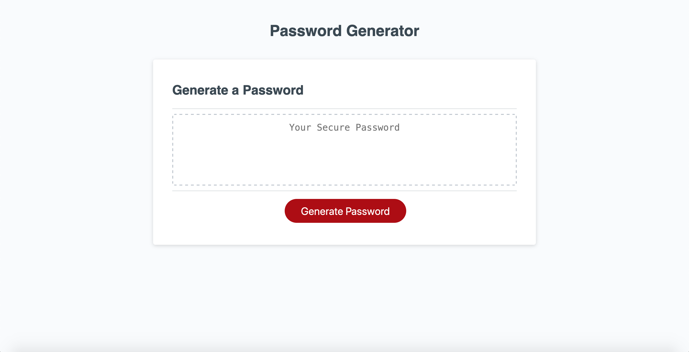

# Secure-key-generator
Secure password generator challenge-module 3.

Modifying  starter code to create an application that enables employees to generate random passwords based on criteria that they’ve selected.
This app will run in the browser and will feature dynamically updated HTML and CSS powered by JavaScript code. It will have a clean and polished, responsive user interface that adapts to multiple screen sizes.

## User Story
AS AN employee with access to sensitive data
I WANT to randomly generate a password that meets certain criteria
SO THAT I can create a strong password that provides greater security

## Acceptance Criteria
GIVEN I need a new, secure password.
 1.WHEN I click the button to generate a password,
    THEN I am presented with a series of prompts for password criteria.
 2.WHEN prompted for password criteria,
    THEN I select which criteria to include in the password.
 3.WHEN prompted for the length of the password,
    THEN I choose a length of at least 8 characters and no more than 128 characters.
 4.WHEN asked for character types to include in the password,
    THEN I confirm whether or not to include lowercase, uppercase, numeric, and/or special characters.
 5.WHEN I answer each prompt,
    THEN my input should be validated and at least one character type should be selected.
 6.WHEN all prompts are answered,
    THEN a password is generated that matches the selected criteria.
 7.WHEN the password is generated,
    THEN the password is either displayed in an alert or written to the page.

## Screenschot

## Discription of the Challenge: Password-generator(Secure-Key-Generator)

1. Initailly commited the stared code of HTML,CSS and javaScript.
2. In HTML linked  the refernce of the CSS styl sheet and JavaScript.
3. Implemented code in the JavaScript along with the starter code.
4. Implemented the main function to generate password so when clicked the button
    to generate a password, then it presents prompts for password criteria.
5. Then implemented prompts to get the password length input from user,
   and choose a length of at least 8 characters and no more than 128 characters,
   and validated length requirements.
6. Then implemented prompts for character types to include lowercase, uppercase, 
    numeric, and/or special characters in the generated passord.
7. Then Validated that generated password has all selected character type.
8. created the password character pool by using different character type that user selected 
    and then called further to create password.
9. Created a base function to create the password from the characterpool and the password 
    length given.
10. Validated at least one character type should be selected.
11. Checked passwords individual character to see if any of it matches with give character
     sequence.
12. Then a new password is generted with all the required acceptance criteria and written to 
    the page.
13. Finally deployed the application.

